# Super Mario Sunshine — PC Port

A native PC port of **Super Mario Sunshine** (GameCube, North America, GMSE01), built from the [matching decompilation](https://github.com/chasem-dev/sms-english). It adds a full launcher and the options you would expect from a PC release: high resolutions, anti-aliasing, fullscreen modes, HD textures, camera options and key rebinding.

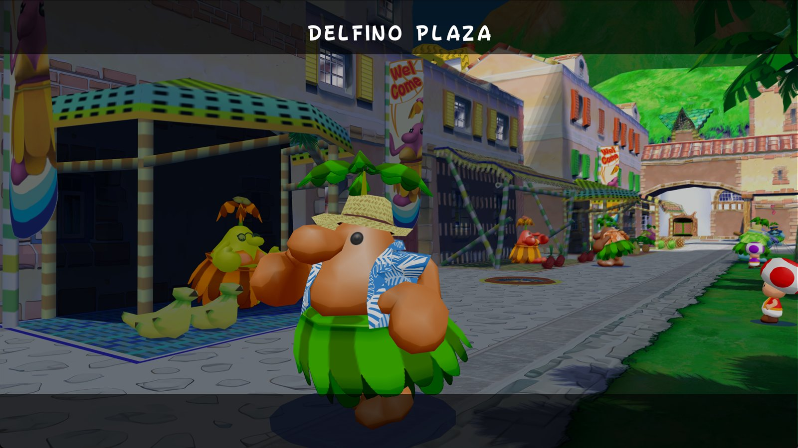

**[Download for Windows or Linux](https://github.com/TekRantGaming/sms-pc-port/releases/latest)**: unzip or run, point the launcher at your disc image, and play.

> No game data is included. The port reads the models, textures, levels, music and movies from **your own disc image** of Super Mario Sunshine (North America, GMSE01, revision 0) at run time.

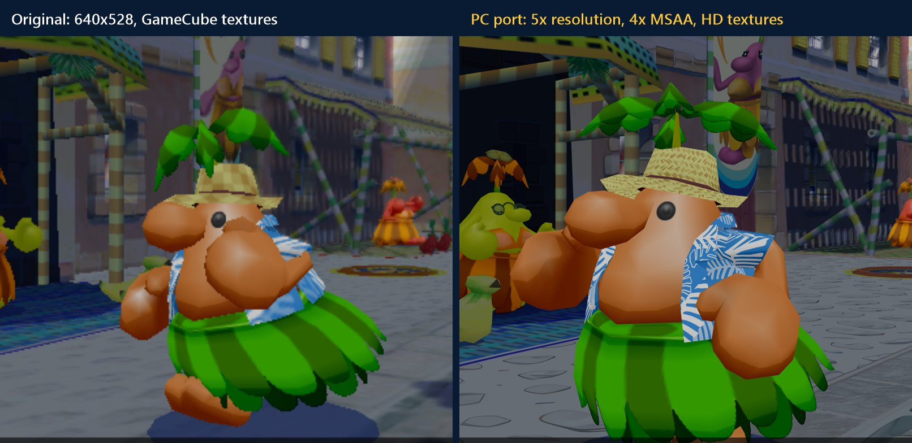

## Features

**Launcher.** A menu opens before the game. It works with the mouse, the keyboard or a controller, and saves everything to `settings.txt` and `bindings.txt`.

- **Install.** Browse for your disc image or drop it on the window. The launcher checks the game, region and revision, then copies the image into place or uses it where it is.
- **Display.** Windowed, borderless or exclusive fullscreen (with a resolution and refresh-rate picker), monitor choice, and vsync (off, on or adaptive). Widescreen 16:9, 16:10, 21:9, 32:9 or matched to your monitor, with the HUD centred or at the screen edges. Keep, stretch or integer aspect, and a smooth, sharp or nearest scaling filter. F11 or Alt+Enter toggles fullscreen in game.
- **Graphics.** Internal resolution from 1x to 8x, with one recommended for your monitor. MSAA 2x/4x/8x, FXAA, anisotropic filtering up to 16x, contrast-adaptive sharpening and brightness.
- **HD textures.** One click downloads and installs the [Super Mario Sunshine UHD Texture Pack](https://github.com/qashto/Super_Mario_Sunshine_UHD_Texture_Pack) (qashto, razius) from its own release. Then switch it on or off, or remove it. Any Dolphin texture pack works in `mods/textures`.
- **Camera.** Invert X and Y separately, a free camera that stays where you point it instead of swinging back behind Mario (L recentres it), camera speed, and mouse look with sensitivity.
- **Gameplay and audio.** 60 fps gameplay at the original speed, skip intro movies, game file mods, a performance overlay and master volume.
- **Controls.** Rebind every keyboard control. Xbox, PlayStation and other controllers work automatically.

| | |
| --- | --- |
| 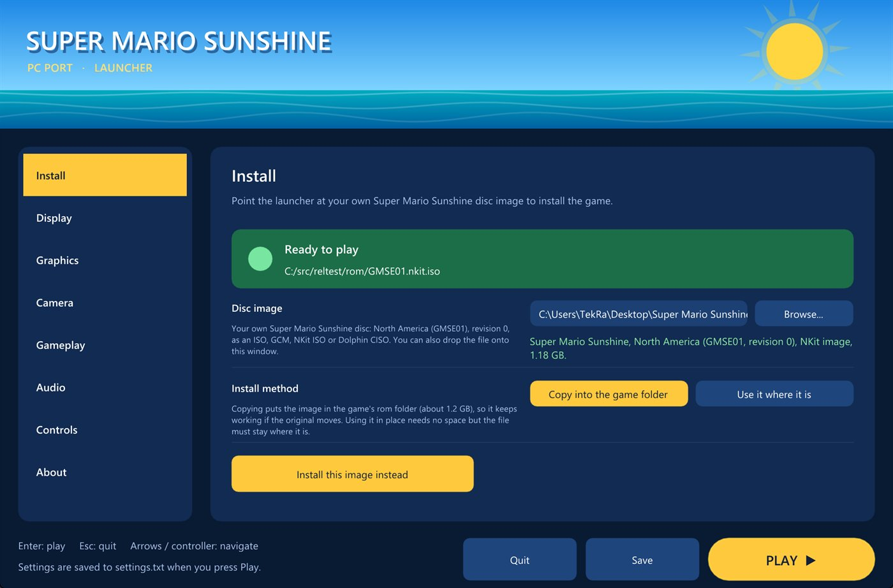 | 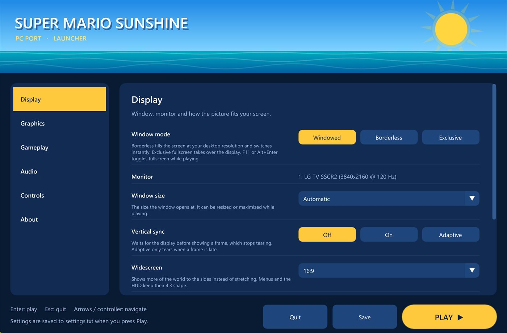 |
| 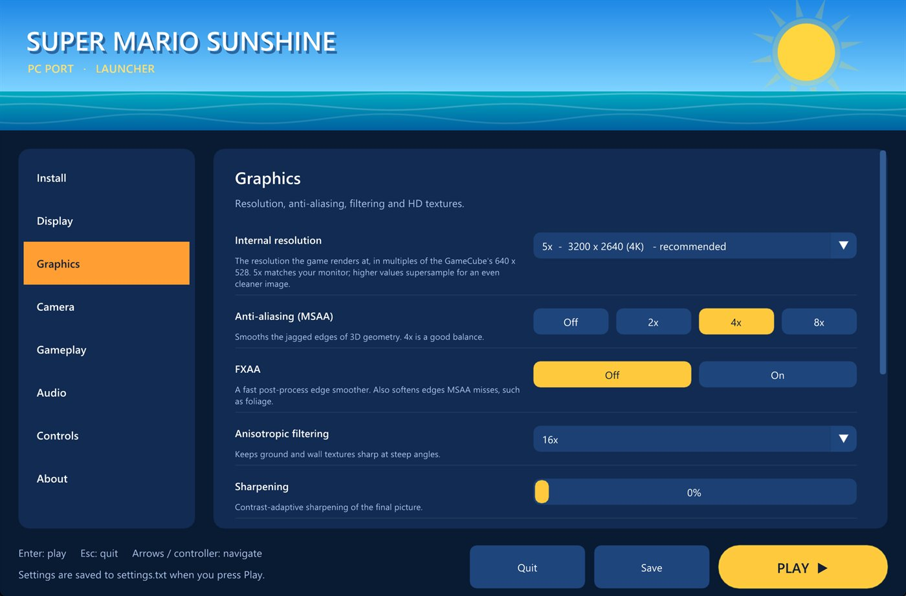 | 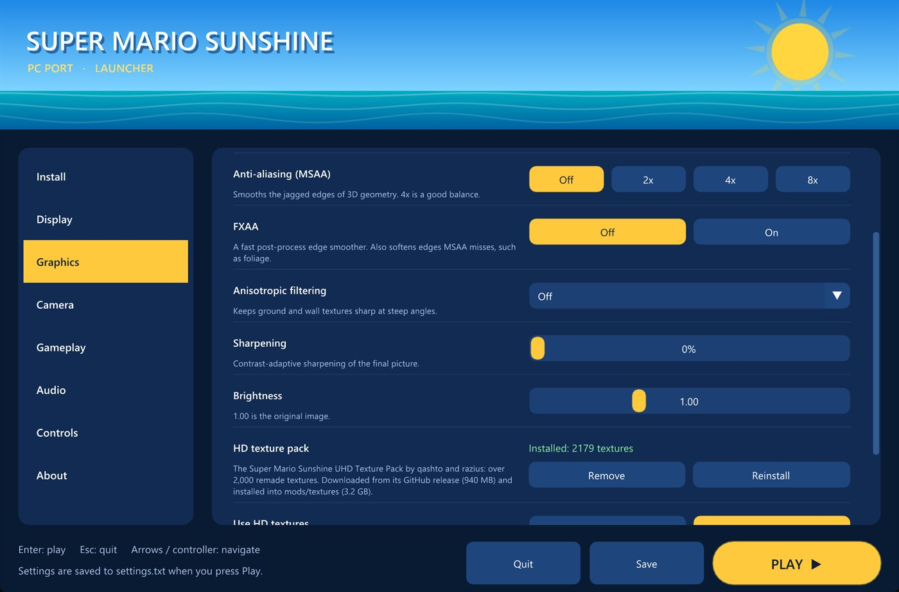 |
| 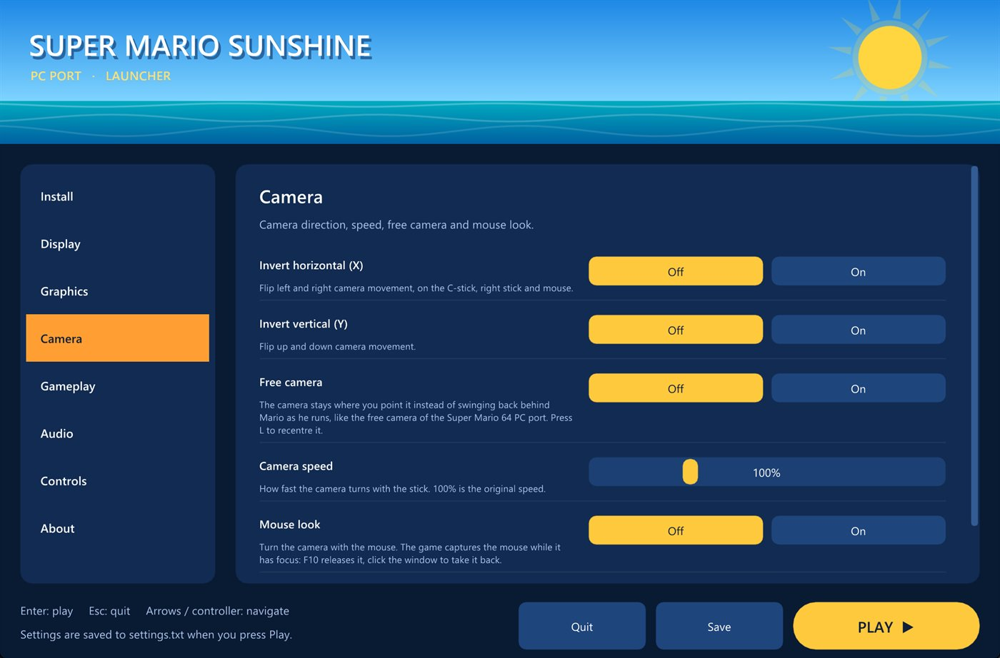 | 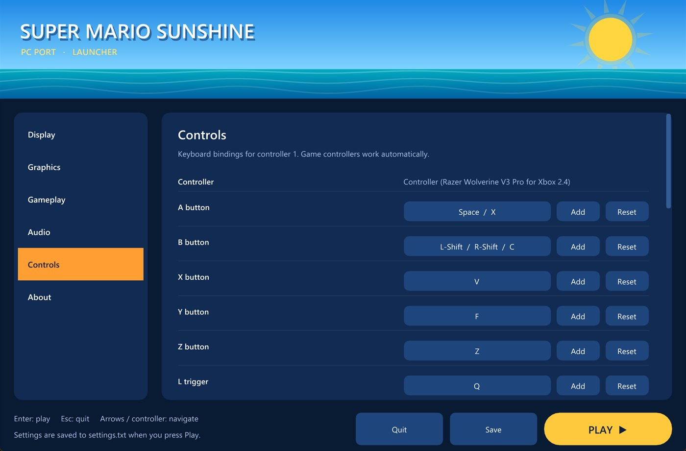 |

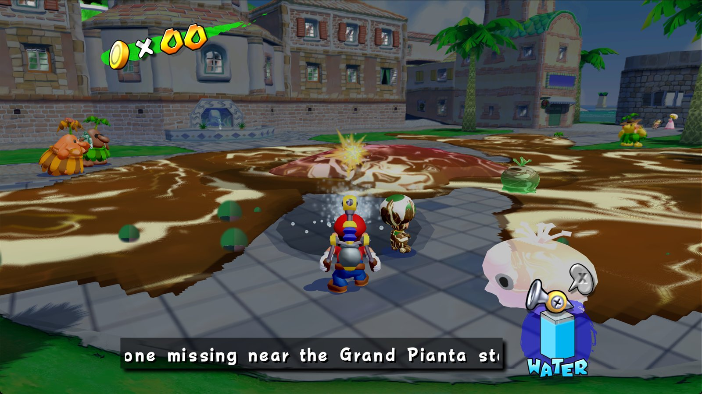
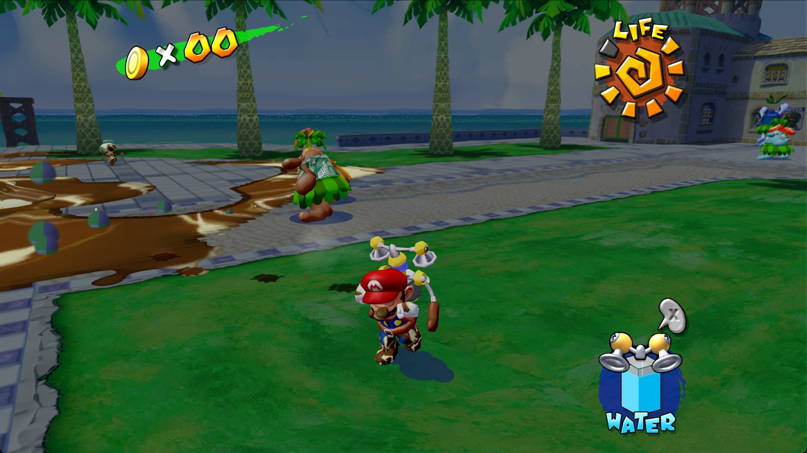

## Playing a release

1. Download the latest release: `SMS-PC-Port-*-windows-x64.zip` (unzip it and run `sms.exe`) or `SMS-PC-Port-*-linux-x86_64.AppImage` (`chmod +x` it and run it).
2. On the launcher's **Install** page, select your disc image and press Install.
3. Optionally install the HD texture pack on the **Graphics** page, and pick your settings.
4. Press **Play**.

On Linux, settings, the installed disc image and mods live in `~/.local/share/sms-port`. Saves go to `%APPDATA%\sms-port\card-a` on Windows and `~/.local/share/sms-port/card-a` on Linux.

## Credits

- The port and the decompilation it builds on: [chasem-dev/sms-pc-port](https://github.com/chasem-dev/sms-pc-port) and [chasem-dev/sms-english](https://github.com/chasem-dev/sms-english), and everyone who contributed to them.
- [Super Mario Sunshine UHD Texture Pack](https://github.com/qashto/Super_Mario_Sunshine_UHD_Texture_Pack) by qashto and razius.
- [Dear ImGui](https://github.com/ocornut/imgui) (MIT) draws the launcher.
- Super Mario Sunshine is © Nintendo. This project is not affiliated with or endorsed by Nintendo. Play it with a copy of the game you own.

---

The sections below describe building the port from source.

## Decompilation progress

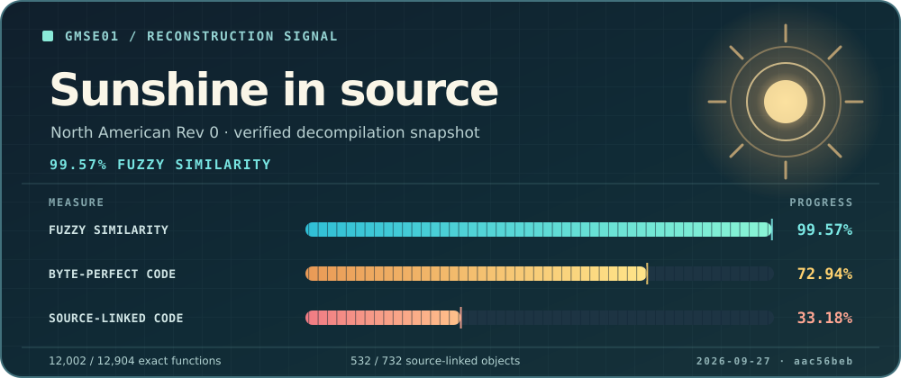

This card shows the [GMSE01 decompilation](https://github.com/chasem-dev/sms-english) snapshot recorded by the source revision pinned in this port.
Fuzzy similarity measures approximate code similarity; the other two tracks show byte-perfect code and code linked from matching source.

## Supported systems

| System | Word size | Status | Output |
| --- | --- | --- | --- |
| Linux (x86) | 32-bit (default) | plays | `build/linux-32/sms` |
| Linux (x86-64) | 64-bit (`SMS_ARCH=64`) | plays; still being tested stage by stage ([docs/64-BIT.md](docs/64-BIT.md)) | `build/linux-64/sms` |
| macOS (Intel, or Apple Silicon under Rosetta 2) | 64-bit | plays | `build/macos-64/sms` |
| Windows (MSYS2 MINGW64) | 64-bit | boots under Wine; native runtime checks | `build/windows-64/sms.exe` |

The game code keeps pointers in 4-byte fields, so it was written for a 32-bit machine.
The 64-bit builds keep every address the game sees below 4 GiB; see [docs/64-BIT.md](docs/64-BIT.md).

## Quick start

1. **Get the source**, including the decompilation submodule:

   ```sh
   git clone --recursive https://github.com/TekRantGaming/sms-pc-port.git
   cd sms-pc-port
   ```

2. **Install the prerequisites** for your system: [Linux](BUILD.md#linux), [macOS](BUILD.md#macos), [Windows](BUILD.md#windows-msys2-mingw64).

3. **Put your disc image in [`rom/`](rom/)**: one `.iso`, `.gcm` or Dolphin `.ciso` of GMSE01 Rev 0.

4. **Build and play:**

   ```sh
   ./build.sh
   ./run.sh
   ```

   On Windows, run these in the MSYS2 MINGW64 shell, or run `.\build.cmd` and `.\run.cmd` from PowerShell.

The first build compiles about 600 game files and takes a while; later builds only rebuild what changed.
Because the image is in `rom/`, `./build.sh` also makes a **standalone** copy with the game's files inside (`sms-standalone`, or `SMS.app` on macOS) that runs without the image.
See [BUILD.md](BUILD.md#standalone-executable).

You can also keep the image elsewhere and pass it: `./run.sh "/path/to/Super Mario Sunshine (US).iso"`.

## Build and run

The same two scripts work on every system:

| Command | What it does |
| --- | --- |
| `./build.sh [IMAGE]` | builds `build/<os>-<arch>/sms`; with an image (argument, `SMS_DISC_IMAGE`, or the one in `rom/`) also the standalone copy |
| `./run.sh [IMAGE] [--headless]` | runs that build: with the image you pass, else the standalone copy, else the image in `rom/` |
| `./clean.sh [--all] [--dry-run]` | deletes the build output (every `build/<os>-<arch>/`); never deletes your disc image, and keeps the downloaded SDL2; `--all` deletes all of `build/` |
| `SMS_ARCH=64 ./build.sh` | chooses the word size (Linux: `32` default or `64`; macOS: `64` only; Windows: `64` default (`32` legacy with MINGW32)) |
| `JOBS=2 ./build.sh` | limits parallel compiler jobs (default: all cores) |

`./build.sh --help`, `./run.sh --help` and `./clean.sh --help` print the details.
When both a 32-bit and a 64-bit build exist, `./run.sh` runs the 32-bit one unless `SMS_ARCH=64` is set.

## Options

Options can be kept in [`settings.txt`](settings.txt) (`resolution = 2`, `texture_packs = on`, ...), or set as environment variables before the command, for example `SMS_SKIP_MOVIES=1 ./run.sh`; an environment variable wins over the file:

| Option | Effect |
| --- | --- |
| `SMS_SKIP_MOVIES=1` | skip the intro and opening movies |
| `SMS_AUDIO=0` | no sound |
| `SMS_SAVE_DIR=dir` | memory card folder |
| `SMS_BINDINGS=file` | key bindings file (default `bindings.txt` in this folder) |
| `SMS_DISC_IMAGE=file` | disc image to use when none is passed |
| `--headless` (after the image) or `SMS_HEADLESS=1` | no window, for testing (Linux only) |
| `SMS_OVERLAY=1` | open the debug overlay at start |
| `SMS_GX_SCALE=n` | render at n times the GameCube's resolution |
| `SMS_WIDESCREEN=16:9` | widescreen (also `21:9`, `16:10`): a wider view, with the HUD and menus kept 4:3 in the middle |
| `SMS_FRAME_RATE=60` | gameplay at 60 frames per second (the game's own timing, not sped up); logos, menus and movies stay at 30 |
| `SMS_WIDESCREEN_HUD=edges` | with widescreen, move the gameplay HUD's counters to the left edge and the water gauge to the right one |

### Launcher and PC options

Before the game starts, a launcher window offers every option below (and key rebinding) in Install, Display, Graphics, Camera, Gameplay, Audio and Controls pages, then writes them to `settings.txt` and `bindings.txt` when you press Play.
It works with the mouse, the keyboard or a controller.
Its Install page takes your disc image (Browse, or drop the file on the window), checks that it is GMSE01 revision 0, and copies it into `rom/` beside `settings.txt` (or uses it where it is), recording it as `disc_image`; started without a disc argument, the game also finds the one image in that `rom/` folder by itself.
`launcher = off` in `settings.txt` (or `--no-launcher`, or `SMS_LAUNCHER=0`) starts the game directly; hold Shift while starting, or pass `--launcher`, to show it anyway.
It runs as a separate process so its window and GPU driver leave the game's low address space alone.

| `settings.txt` | Variable | Effect |
| --- | --- | --- |
| `window_mode = borderless` | `SMS_WINDOW_MODE` | `windowed`, `borderless` (fullscreen at desktop resolution) or `fullscreen` (exclusive); F11 or Alt+Enter toggles while playing |
| `display = 1` | `SMS_DISPLAY` | the monitor to open on (0 is the primary one) |
| `fullscreen_mode = 2560x1440@144` | `SMS_FULLSCREEN_MODE` | the display mode for exclusive fullscreen (`desktop` by default) |
| `vsync = adaptive` | `SMS_VSYNC` | `on`, `off` or `adaptive` (tears only when a frame is late) |
| `msaa = 4` | `SMS_MSAA` | multisample anti-aliasing: 2, 4 or 8 samples |
| `fxaa = on` | `SMS_FXAA` | FXAA post-process anti-aliasing |
| `anisotropic = 16` | `SMS_ANISO` | anisotropic texture filtering |
| `sharpen = 30` | `SMS_SHARPEN` | contrast-adaptive sharpening, 0 to 100 |
| `brightness = 1.2` | `SMS_GAMMA` | brightness curve (1.0 is the original) |
| `aspect = stretch` | `SMS_ASPECT` | `keep` (letterboxed), `stretch` or `integer` (whole multiples of 640x528) |
| `present_filter = sharp` | `SMS_PRESENT_FILTER` | `bilinear` (area-averaged when the internal resolution exceeds the window, so it supersamples), `sharp` or `nearest` |
| `volume = 70` | `SMS_VOLUME` | master volume, 0 to 100 |
| `camera_invert_x = on` | `SMS_CAMERA_INVERT_X` | invert the camera's horizontal control (C-stick, right stick, camera keys and mouse) |
| `camera_invert_y = on` | `SMS_CAMERA_INVERT_Y` | invert the camera's vertical control |
| `free_camera = on` | `SMS_FREE_CAMERA` | the normal camera stays where you point it instead of swinging back behind Mario; L recentres it |
| `camera_speed = 150` | `SMS_CAMERA_SPEED` | manual camera rotation speed in percent (100 is the original) |
| `mouse_camera = on` | `SMS_MOUSE_CAMERA` | mouse look: the window captures the mouse while focused; F10 releases it, a click takes it back |
| `mouse_sensitivity = 150` | `SMS_MOUSE_SENSITIVITY` | mouse look speed in percent |

### Releases

`packaging/package.sh` turns a build into a release package without game data: a zip of `sms.exe` and its DLLs on Windows (MSYS2 MINGW64), and a 64-bit AppImage on Linux (after `SMS_ARCH=64 ./build.sh`), which keeps its settings, installed disc image and mods in `~/.local/share/sms-port`.
The workflow in `.github/workflows/release.yml` builds both on every push and publishes them as a GitHub release when a `v*` tag is pushed.

Optional mods, such as HD texture packs, go in [`mods/`](mods/README.md); `python3 tools/mods/get.py textures` downloads and installs the UHD texture pack there.

Saves go to a memory card in slot A, kept as files in `~/.local/share/sms-port/card-a` on Linux and macOS (`$XDG_DATA_HOME/sms-port/card-a` if that is set) and in `%APPDATA%\sms-port\card-a` on Windows.
Every other switch (debugging, tracing, graphics) is listed in [docs/DEVELOPMENT.md](docs/DEVELOPMENT.md#environment-variables).

## Frame rate

The game runs at 30 frames a second, and like on the GameCube a frame that takes longer than two retraces (33 ms) waits for the next one, so a slow frame shows as 20 or 15 fps rather than 28.
The debug overlay (backtick) shows where each frame's time goes:

- `game`: the game's own code (and the GX commands it writes).
- `GX`: the renderer, split into `vertices` (loading GX vertices), `batches` (issuing draws), `textures`, `copies` (EFB copies) and `peeks`.
  `waiting for the GPU` is the part of it spent blocked on the GPU.
- `present` and `swap`: drawing the frame to the window and `SDL_GL_SwapWindow`.
- `idle`: the game waiting for the next retrace, which is spare time.

If the overlay's `GL` line says `llvmpipe`, `softpipe` or `Software`, the game is rendering on the CPU and cannot hold 30 fps.
On Linux this is usually the 32-bit build without the GPU driver's 32-bit libraries; build 64-bit (`SMS_ARCH=64 ./build.sh`) or see [BUILD.md](BUILD.md#troubleshooting).

## Controls

Controller 1 reads the keyboard and any game controller SDL recognises (A/B/X/Y, Start, right shoulder = Z, triggers = L/R, sticks, d-pad).
Keyboard defaults:

| GameCube | Keys |
| --- | --- |
| Control stick | arrow keys or WASD (hold Left Ctrl for half tilt) |
| C-stick | I / J / K / L |
| A | Space or X |
| B | Shift or C |
| X / Y | V / F |
| Z | Z |
| L / R (full press) | Q / E |
| Start | Enter |
| D-pad | 1 2 3 4 (up, down, left, right) or keypad 8 2 4 6 |
| Debug overlay (frame rate, stats, keys) | ` (backtick) |
| Game and movie speed x1 / x2 / x4 / x10 (overlay open) | F7 |
| Quit | Esc |

To change them, edit [`bindings.txt`](bindings.txt) (`CONTROL = KEY KEY ...`, one control per line; a line replaces that control's defaults), or point `SMS_BINDINGS` at another file.

On the file-select screen, walk Mario left under a block for about half a second and press A to jump into it.

## Repository layout

```
build.sh, run.sh      build and run, on every system
clean.sh              delete build output
*.cmd                 the same three from PowerShell or Command Prompt (Windows)
bindings.txt          keyboard bindings
rom/                  your disc image (ignored by git)
build/<os>-<arch>/    build output (ignored by git)
decomp/               the decompilation (git submodule: sms-english)
decomp-patches/       PC-only changes applied to copies of decomp sources at configure time
platform/             host replacements for the GameCube SDK: graphics, disc, audio, input, OS
src/                  entry point and compatibility headers
tools/                build helpers and developer tools
docs/                 developer documentation and reference screenshots
```

## Documentation

- [BUILD.md](BUILD.md): prerequisites for each system, the standalone build and macOS app, manual CMake builds, troubleshooting.
- [docs/DEVELOPMENT.md](docs/DEVELOPMENT.md): where a fix goes (decomp, patch or platform), how the build works, the platform layer, the decomp patches, every environment variable, developer tools, performance.
- [docs/64-BIT.md](docs/64-BIT.md): how the 64-bit build works and what is left.
- `platform/*/README.md`: each platform module in detail.

The standalone build contains the whole game, so keep it to yourself: sharing it is sharing the game.
